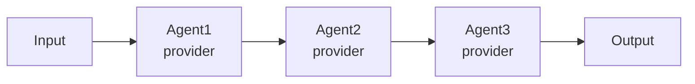
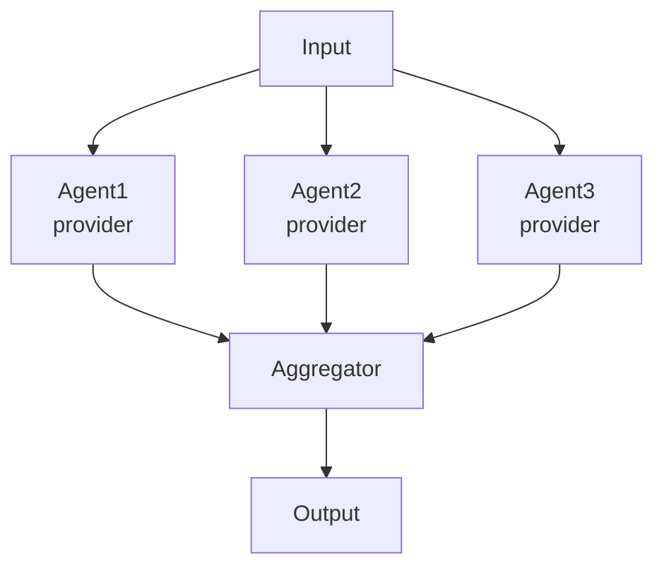
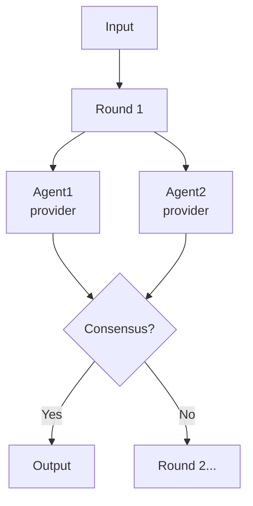
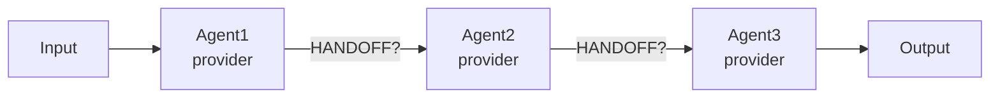
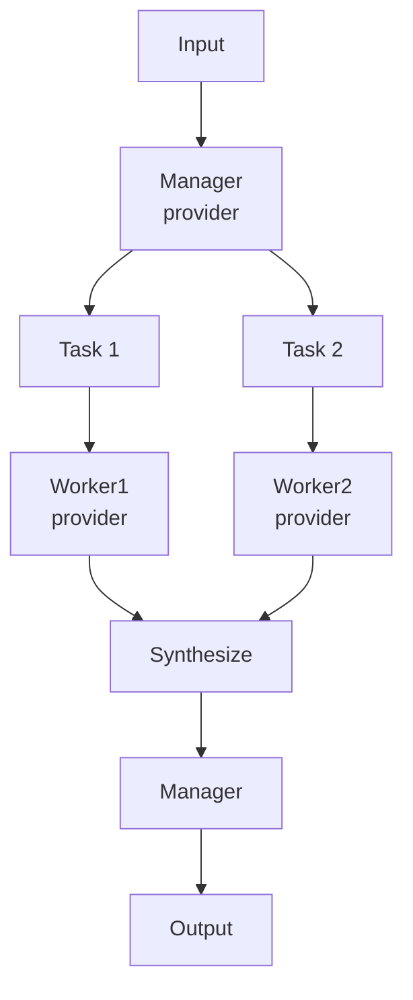

# Pattern Comparison UI - Detailed Requirements Specification

## 1. Overview

A web-based interface for comparing different LLM agent orchestration patterns side-by-side. The UI allows users to configure multiple orchestration patterns with different agent configurations, execute them all in parallel with the same input prompt, and compare their execution behavior and results across tabs.

**Primary Goal**: Enable data scientists and AI engineers to visually compare how different orchestration patterns (Sequential, Concurrent, Group Chat, Handoff, Magentic) perform with the same input.

---

## 2. Architecture Overview

### 2.1 Technology Stack
- **Frontend**: HTML5, CSS3 (Cyberpunk theme), Vanilla JavaScript (ES6+)
- **Visualization**: Mermaid.js for DAG (Directed Acyclic Graph) rendering
- **Communication**: WebSocket for real-time bidirectional streaming
- **Backend**: Rust/Axum server with pattern execution engine

### 2.2 Communication Protocol
- Client sends `CompareRequest` JSON via WebSocket containing all pattern configurations
- Server executes all patterns in parallel using `tokio::spawn`
- Server streams `ExecutionEvent` messages back for each pattern via WebSocket
- Events are routed to appropriate tabs using `pattern_id` field

---

## 3. Visual Design Theme

### 3.1 Cyberpunk Neon Aesthetic
**Color Palette**:
- Background: Very dark navy/black (#0a0a0f, #12121c, #1a1a28)
- Primary accent: Cyan/teal (#00ffff) - used for borders, headers, active states
- Success: Bright green (#00ff00) - for completed patterns, DAG nodes
- Warning: Yellow (#ffff00) - for running states, key highlights
- Error: Red (#ff0000) - for error states
- Secondary: Magenta (#ff00ff) - for outputs, special indicators

**Typography**:
- Headers: "Orbitron" - futuristic, tech-focused font
- Body: "Rajdhani" - clean, readable sans-serif
- Code/Logs: "Share Tech Mono" - monospace for technical content

**Visual Effects**:
- Neon glow effects on borders and buttons (box-shadow with blur)
- Subtle animations on hover and state changes
- Scanline/grid effects for cyberpunk feel (optional)
- High contrast for readability

---

## 4. Layout Structure

### 4.1 Overall Layout (Top to Bottom)

```
┌─────────────────────────────────────────────────────────┐
│                    HEADER SECTION                        │
│  Logo/Title        WebSocket Status    [EXECUTE ALL]    │
└─────────────────────────────────────────────────────────┘
┌─────────────────────────────────────────────────────────┐
│                   ROOT PROMPT INPUT                      │
│  (Large textarea for the shared input to all patterns)   │
└─────────────────────────────────────────────────────────┘
┌─────────────────────────────────────────────────────────┐
│               PATTERN TAB NAVIGATION                     │
│ [Sequential] [Concurrent] [Group Chat] [Handoff] [...]  │
│   READY        RUNNING      COMPLETE     ERROR           │
└─────────────────────────────────────────────────────────┘
┌─────────────────────────────────────────────────────────┐
│                   ACTIVE PANEL CONTENT                   │
│  ┌───────────────────────────────────────────────────┐  │
│  │ Pattern Description (How it works, scaling, etc)  │  │
│  └───────────────────────────────────────────────────┘  │
│  ┌───────────────────────────────────────────────────┐  │
│  │ Agent Configuration Cards                         │  │
│  │  [Agent 1] [Agent 2] [+ADD AGENT]                 │  │
│  └───────────────────────────────────────────────────┘  │
│  ┌───────────────────────────────────────────────────┐  │
│  │ Expected Execution DAG (Mermaid visualization)    │  │
│  └───────────────────────────────────────────────────┘  │
│  ┌───────────────────────────────────────────────────┐  │
│  │ Execution Log (Real-time event stream)           │  │
│  └───────────────────────────────────────────────────┘  │
│  ┌───────────────────────────────────────────────────┐  │
│  │ Final Result (Pattern output)                     │  │
│  └───────────────────────────────────────────────────┘  │
└─────────────────────────────────────────────────────────┘
```

### 4.2 Responsive Behavior
- Minimum width: 1024px (desktop-focused application)
- Agent configuration cards: Grid layout with auto-fill, minimum 300px per card
- Logs and results: Scrollable with max-height constraints
- Tabs: Horizontal scrolling on smaller screens if needed

---

## 5. Detailed Component Requirements

### 5.1 Header Section

**Elements**:
1. **Title/Logo**: "RIG-PATTERNS NEURAL ORCHESTRATION SYSTEM" (left-aligned)
   - Font: Orbitron, large, uppercase, cyan color
   - Optional: Animated glitch effect or neon glow

2. **WebSocket Status Indicator** (center-right)
   - Circular dot: Green (connected), Yellow (connecting), Red (disconnected), Gray (not started)
   - Text label: "CONNECTED" / "CONNECTING" / "DISCONNECTED" / "OFFLINE"
   - Updates in real-time based on WebSocket state

3. **Execute All Button** (right-aligned)
   - Large, prominent button with neon cyan border
   - Text: "EXECUTE ALL PATTERNS" or "▶ EXECUTE ALL"
   - Hover effect: Brighter glow, slight scale increase
   - Disabled state: When WebSocket disconnected or already executing
   - On click: Collects all pattern configs, sends CompareRequest via WebSocket

**Layout**: Flexbox with space-between alignment

---

### 5.2 Root Prompt Input Section

**Purpose**: Single input shared across all patterns for fair comparison

**Design**:
- Large textarea (minimum 4 rows, expandable)
- Placeholder: "Enter your prompt here. This will be sent to all patterns for comparison..."
- Styling: Dark background, cyan border, neon glow on focus
- Character counter (optional): Show input length
- Label: "Root Prompt" in cyan with icon (🎯 or similar)

**Behavior**:
- Auto-resize as user types (within limits)
- Persist value in state
- Required validation: Don't allow execution if empty

---

### 5.3 Pattern Tab Navigation

**Structure**: Horizontal tab bar with 5 tabs

**Tab Order** (left to right):
1. Sequential 🔗
2. Concurrent ⚡
3. Group Chat 💬
4. Handoff 🔀
5. Magentic 🎯

**Each Tab Contains**:
- **Tab Button**:
  - Icon + Pattern Name (uppercase)
  - Status Badge: "READY" / "RUNNING" / "COMPLETE" / "ERROR"
  - Active state: Brighter background, bottom border glow
  - Inactive state: Dimmed, hover brightens

**Status Badge Colors**:
- READY: Gray/dim
- RUNNING: Yellow/amber with pulse animation
- COMPLETE: Green
- ERROR: Red

**Behavior**:
- Click tab to switch active panel
- Only one panel visible at a time
- Tab state persists across switches
- Status badges update in real-time during execution

**Implementation Note**: Use `data-pattern` attribute for pattern identification

---

### 5.4 Pattern Panel Content

Each of the 5 pattern panels contains identical structure but different content:

#### 5.4.1 Pattern Description Section

**Content Structure** (for each pattern):

```html
<h3>[Icon] [Pattern Name]</h3>

<p><strong>How it works:</strong> [Detailed explanation of execution model]</p>

<p><strong>Adding agents:</strong> [Explanation of how scaling affects behavior]</p>

<p><strong>Best for:</strong> [Use case recommendations]</p>
```

**Specific Content**:

**Sequential Pattern 🔗**:
- **How it works**: "Agents execute in order, forming a processing pipeline. Each agent receives the output of the previous agent as its input, allowing for progressive refinement and multi-stage processing."
- **Adding agents**: "Each additional agent adds another stage to the pipeline, increasing processing depth. Use this for workflows like research → analysis → summary, or translation → editing → formatting."
- **Best for**: "Multi-step workflows, progressive refinement, chain-of-thought processing."

**Concurrent Pattern ⚡**:
- **How it works**: "All agents receive the same input simultaneously and process it in parallel. Their outputs are collected and aggregated into a single result using the configured aggregation strategy (combine, vote, or consensus)."
- **Adding agents**: "More agents provide diverse perspectives on the same problem. Each agent can use different models or prompts, enabling comparison of approaches or gathering multiple viewpoints that get synthesized."
- **Best for**: "Comparing different models, gathering diverse opinions, parallel processing, consensus-building."

**Group Chat Pattern 💬**:
- **How it works**: "Agents engage in multi-round discussions, where each agent can see and respond to outputs from all other agents. The conversation continues for a configured number of rounds or until consensus emerges."
- **Adding agents**: "More agents enrich the conversation with additional perspectives and expertise. Each agent can represent different roles (critic, supporter, specialist) leading to more thorough deliberation."
- **Best for**: "Collaborative problem-solving, debate and deliberation, complex decision-making, peer review scenarios."

**Handoff Pattern 🔀**:
- **How it works**: "The first agent processes the input and can explicitly hand off to specific downstream agents using HANDOFF markers in its output. This creates dynamic, context-dependent routing where the execution path is determined by agent decisions."
- **Adding agents**: "More agents expand the available specialist pool. Each agent can be an expert in a specific domain, and the routing agent(s) can hand off to the most appropriate specialist based on the task requirements."
- **Best for**: "Dynamic routing, context-dependent workflows, specialist coordination, adaptive task delegation."

**Magentic Pattern 🎯**:
- **How it works**: "A manager agent decomposes the input into subtasks, delegates them to worker agents running in parallel, then synthesizes their outputs into a final result. This hierarchical approach combines planning with parallel execution."
- **Adding agents**: "The first agent is always the manager. Each additional agent becomes a worker that can be assigned subtasks. More workers increase the system's capacity for parallel task execution and specialized processing."
- **Best for**: "Complex tasks requiring decomposition, hierarchical planning, parallel subtask execution, divide-and-conquer strategies."

**Note for Magentic**: Display warning/info text: "Note: First agent is the Manager, additional agents are Workers"

**Styling**:
- H3: Cyan, Orbitron font, uppercase, 1.5rem
- Strong tags: Yellow/amber color for key terms
- Paragraphs: Light text color, good line spacing (1.6)

---

#### 5.4.2 Agent Configuration Section

**Purpose**: Allow users to configure agents (LLM models) for each pattern

**Structure**:
- Section header: "◈ Agent Configuration"
- Grid of agent cards (responsive, auto-fill, min 300px per card)
- "+ ADD AGENT" button at the bottom

**Agent Card Design**:

```
┌─────────────────────────────────────┐
│ [Agent ID Input]              [×]   │ ← Header with remove button
├─────────────────────────────────────┤
│ Provider: [Dropdown ▼]              │ ← openai/anthropic/cohere
│ Model: [Text Input]                 │ ← gpt-4, claude-3-opus, etc
│ System Prompt:                      │
│ [Textarea - multi-line]             │ ← Agent's system instructions
└─────────────────────────────────────┘
```

**Card Elements**:

1. **Agent ID Input**:
   - Placeholder: "agent-id"
   - Used for identification in logs and DAG
   - Editable at any time
   - Updates DAG in real-time when changed

2. **Remove Button (×)**:
   - Top-right corner
   - Red on hover
   - Removes card and updates DAG
   - Minimum: Allow at least 1 agent per pattern

3. **Provider Dropdown**:
   - Options: "openai", "anthropic", "cohere"
   - Default: "openai"
   - Updates DAG label when changed

4. **Model Input**:
   - Placeholder: "gpt-4" / "claude-3-opus-20240229" / "command-r-plus"
   - Free text input for model name
   - Sent to backend for LLM API calls

5. **System Prompt Textarea**:
   - Placeholder: "You are a helpful assistant..."
   - Multi-line, expandable
   - Allows customization of agent behavior
   - Default prompts vary by pattern

**Card Styling**:
- Dark background with cyan border
- Slight glow effect
- Border brightens on hover
- Inputs: Dark background, cyan borders, focus glow

**"+ ADD AGENT" Button**:
- Below agent cards grid
- Cyan border, hover glow effect
- Adds new agent card with default values
- Immediately updates DAG to show new agent

**Real-time Updates**:
- Any change to agent ID, provider, or model triggers DAG re-render
- Changes saved to state immediately
- No "Save" button needed - all edits are live

---

#### 5.4.3 Expected Execution DAG Section

**Purpose**: Visualize the execution flow before running the pattern

**Section Header**: "◬ Expected Execution DAG"

**Visualization**: Mermaid.js flowchart/graph

**DAG Generation Rules** (by pattern):

**1. Sequential**:

- Linear left-to-right flow
- Each agent connects to the next
- Show agent ID and provider on each node

**2. Concurrent**:

- Top-down flow
- All agents in parallel from INPUT
- All agents feed into Aggregator node
- Aggregator produces OUTPUT

**3. Group Chat**:

- Shows multi-round structure
- Diamond node for consensus decision
- Indicates iterative nature

**4. Handoff**:

- Linear flow with conditional handoffs
- Edge labels indicate decision points
- Shows potential routing paths

**5. Magentic**:

- Hierarchical structure
- First agent is always Manager
- Shows task decomposition and synthesis
- Workers process in parallel

**Node Styling** (Applied via Mermaid style directives):
- INPUT/OUTPUT: Dark background, cyan border
- Agents: Dark background, green border
- Special nodes (Aggregator, Manager, Consensus): Dark background, yellow border

**Container Styling**:
- Dark background with subtle border
- Pre-formatted text block for Mermaid code
- Auto-renders when Mermaid library processes
- Re-renders when agents change

**Dynamic Updates**:
- DAG regenerates whenever:
  - Agent added
  - Agent removed
  - Agent ID changed
  - Provider changed
- Uses `mermaid.run({ nodes: [dagElement] })` to re-render
- Clears `data-processed` attribute before re-render

---

#### 5.4.4 Execution Log Section

**Purpose**: Display real-time events during pattern execution

**Section Header**: "◉ Execution Log"

**Container**:
- Dark background, cyan border
- Max height: 400px
- Scrollable (auto-scroll to bottom on new entries)
- Initially shows placeholder: "Awaiting execution..."

**Log Entry Types** (based on ExecutionEvent from backend):

**1. agent_receives_input**:
```
[HH:MM:SS] Agent1 (openai) RECEIVES INPUT
└─ "Tell me about quantum computing..."
```
- Cyan left border
- Shows timestamp, agent ID, provider
- Truncated input preview (first 100 chars)

**2. agent_thinking**:
```
[HH:MM:SS] Agent1 (openai) THINKING...
```
- Yellow left border
- Optional pulse animation

**3. agent_responds**:
```
[HH:MM:SS] Agent1 (openai) RESPONDS
└─ "Quantum computing is a revolutionary approach..."
```
- Green left border
- Full response text (scrollable within entry)

**4. agent_handoff**:
```
[HH:MM:SS] HANDOFF
└─ Agent1 (openai) → Agent2 (anthropic)
```
- Magenta left border
- Shows from → to direction

**5. pattern_step**:
```
[HH:MM:SS] STEP
└─ "Starting round 2 of group chat"
```
- Blue left border
- Pattern-specific progress messages

**6. conversation_message**:
```
[HH:MM:SS] Agent1 (openai) BROADCAST
└─ "I think we should approach this differently..."
```
- Used in group chat pattern
- Different colors for message types

**7. pattern_complete**:
```
[HH:MM:SS] ✅ PATTERN COMPLETE
└─ Output: "Final synthesized result..."
```
- Green left border, green background tint
- Bold "PATTERN COMPLETE" text
- Shows final output

**8. pattern_error**:
```
[HH:MM:SS] ❌ ERROR
└─ "Failed to connect to OpenAI API: timeout"
```
- Red left border, red background tint
- Error message in red text

**Log Entry Styling**:
- Each entry: Padding, margin, rounded corners
- Timestamp: Dimmed color
- Agent ID: Bold, cyan
- Message type: Uppercase, colored badge
- Content: Indented, wrapped text
- Animation: Slide-in from top on new entries

**Behavior**:
- Auto-scroll to bottom when new entry added
- User can scroll up to review history
- Clicking entry could expand/collapse (optional)
- Clear button to reset log (optional)

---

#### 5.4.5 Final Result Section

**Purpose**: Display the final output separately from execution logs for easy comparison

**Section Header**: "✓ Final Result"

**Container**:
- Dark background with GREEN neon border (distinguishes from logs)
- Max height: 500px
- Scrollable if content exceeds
- Initially shows placeholder: "No result yet. Execute patterns to see the final output."

**Content Display**:

**Success State**:
```
┌─────────────────────────────────────┐
│ ✓ Final Result                      │
├─────────────────────────────────────┤
│ │ [Full output text from pattern]   │ ← Green left border
│ │ Multi-line, formatted...          │
│ │                                   │
└─────────────────────────────────────┘
```
- Green left border (4px)
- Light green background tint (5% opacity)
- Monospace font for readability
- White-space: pre-wrap (preserves formatting)
- Word-wrap for long lines

**Error State**:
```
┌─────────────────────────────────────┐
│ ✓ Final Result                      │
├─────────────────────────────────────┤
│ │ ❌ Error: [Error message]         │ ← Red left border
│ │                                   │
└─────────────────────────────────────┘
```
- Red left border (4px)
- Light red background tint (5% opacity)
- Red text color
- Monospace font

**Population Trigger**:
- Populated when `pattern_complete` event received
- Or when `pattern_error` event received
- Clears placeholder and inserts actual content
- Scrolls to top of result automatically

**Comparison Use Case**:
- User can switch between tabs to compare final results
- Each pattern's result persists even when switching tabs
- Clear visual separation makes it easy to focus on just the output

---

## 6. State Management

### 6.1 Application State Object

```javascript
state = {
    patterns: {
        sequential: [
            { id: 'agent1', provider: 'openai', model: 'gpt-4', system_prompt: '...' },
            { id: 'agent2', provider: 'anthropic', model: 'claude-3-opus', system_prompt: '...' }
        ],
        concurrent: [ /* agents */ ],
        group_chat: [ /* agents */ ],
        handoff: [ /* agents */ ],
        magentic: [ /* agents */ ]
    },
    currentPattern: 'sequential', // Which tab is active
    ws: null, // WebSocket instance
    isExecuting: false // Execution in progress flag
}
```

### 6.2 State Updates

**Agent Management**:
- `addAgent(pattern, id, provider, model, prompt)`: Adds agent to pattern's array
- `removeAgent(pattern, agentId)`: Removes agent from pattern's array
- `updateAgent(pattern, agentId, field, value)`: Updates specific agent field

**Pattern Switching**:
- `switchPattern(patternId)`: Updates currentPattern, shows/hides panels

**Execution State**:
- `setExecuting(boolean)`: Updates isExecuting, disables/enables execute button

---

## 7. WebSocket Communication

### 7.1 Message Formats

**Client → Server (CompareRequest)**:
```json
{
    "input": "Explain quantum computing",
    "pattern_configs": {
        "sequential": {
            "pattern": { "type": "sequential" },
            "agents": [
                {
                    "id": "researcher",
                    "provider": "openai",
                    "model": "gpt-4",
                    "system_prompt": "You are a research assistant..."
                },
                {
                    "id": "summarizer",
                    "provider": "anthropic",
                    "model": "claude-3-opus-20240229",
                    "system_prompt": "You are a summarization expert..."
                }
            ]
        },
        "concurrent": {
            "pattern": {
                "type": "concurrent",
                "aggregation": "combine"  // MUST be lowercase!
            },
            "agents": [ /* ... */ ]
        },
        "group_chat": {
            "pattern": {
                "type": "group_chat",
                "max_rounds": 3
            },
            "agents": [ /* ... */ ]
        },
        "handoff": {
            "pattern": {
                "type": "handoff",
                "max_hops": 5
            },
            "agents": [ /* ... */ ]
        },
        "magentic": {
            "pattern": {
                "type": "magentic",
                "max_iterations": 5
            },
            "agents": [ /* ... */ ]
        }
    }
}
```

**CRITICAL**:
- `aggregation` values MUST be lowercase: "combine", "vote", "consensus"
- Pattern types MUST be lowercase: "sequential", "concurrent", etc.

**Server → Client (ExecutionEvent)**:
```json
{
    "type": "agent_receives_input",
    "pattern_id": "sequential",
    "agent_id": "researcher",
    "provider": "openai",
    "input": "Explain quantum computing",
    "timestamp": "2025-11-10T12:34:56.789Z"
}
```

### 7.2 Event Types

All events include:
- `type`: Event type identifier
- `pattern_id`: Which pattern this event belongs to
- `timestamp`: ISO 8601 timestamp

**Event Types**:
1. `agent_receives_input`: Agent starts processing
2. `agent_thinking`: Agent is generating response
3. `agent_responds`: Agent completed response
4. `agent_handoff`: Handoff occurred (from_agent, to_agent, from_provider, to_provider)
5. `pattern_step`: General progress message
6. `conversation_message`: Group chat message (from, message, message_type)
7. `pattern_complete`: Pattern finished successfully (output)
8. `pattern_error`: Pattern encountered error (error)

### 7.3 Event Routing

**Client-side routing logic**:
```javascript
ws.onmessage = (event) => {
    const message = JSON.parse(event.data);
    const patternId = message.pattern_id; // e.g., "sequential"

    // Route to appropriate log element
    const logElement = document.getElementById(`log-${patternId}`);

    // Append log entry
    appendLogEntry(logElement, message);

    // Update final result if complete
    if (message.type === 'pattern_complete') {
        updateFinalResult(patternId, message.output, 'success');
    }
};
```

---

## 8. User Interaction Flows

### 8.1 Initial Setup Flow

1. User opens application in browser
2. UI loads with default agents (2 agents per pattern with preset configurations)
3. All 5 tabs are initialized but only Sequential is visible
4. WebSocket shows "OFFLINE" status
5. Execute button is enabled

### 8.2 Agent Configuration Flow

1. User clicks a tab (e.g., "Concurrent")
2. Panel switches, showing Concurrent pattern's content
3. User sees 2 default agent cards
4. User clicks "+ ADD AGENT"
5. New agent card appears with default values
6. DAG re-renders showing 3 agents in parallel
7. User edits agent ID to "expert1"
8. DAG re-renders with updated label
9. User changes provider to "anthropic"
10. DAG re-renders with updated provider label
11. User edits system prompt
12. Changes saved to state immediately

### 8.3 Execution Flow

1. User enters prompt: "Explain quantum computing in simple terms"
2. User clicks "Execute All Patterns"
3. WebSocket connection initiated
4. Status changes to "CONNECTING" (yellow dot)
5. Once connected: Status changes to "CONNECTED" (green dot)
6. CompareRequest JSON constructed from state
7. JSON sent via WebSocket
8. All tab badges change to "RUNNING" with yellow color
9. Events start streaming back from server
10. Each event routed to appropriate tab's log based on pattern_id
11. User can switch tabs to watch different patterns execute in real-time
12. As each pattern completes:
    - Badge changes to "COMPLETE" (green)
    - Final Result section populates
    - Log shows "✅ PATTERN COMPLETE"
13. User switches between tabs to compare final results
14. WebSocket closes when all patterns complete
15. Status changes to "DISCONNECTED"
16. Execute button re-enabled for another run

### 8.4 Error Handling Flow

**Scenario 1: Agent configuration error**
- User removes all agents from a pattern
- Execute button should warn or prevent execution
- Validation message: "Each pattern must have at least 1 agent"

**Scenario 2: Network error**
- WebSocket connection fails
- Status shows "ERROR" (red dot)
- Execute button disabled
- User sees error message
- Option to retry connection

**Scenario 3: Pattern execution error**
- Pattern encounters error (e.g., API rate limit)
- Event type: "pattern_error"
- Tab badge shows "ERROR" (red)
- Error appears in execution log
- Final Result section shows error with red styling
- Other patterns continue executing independently

---

## 9. Technical Implementation Details

### 9.1 Mermaid.js Integration

**Initialization** (in DOMContentLoaded):
```javascript
mermaid.initialize({
    startOnLoad: true,
    theme: 'dark',
    themeVariables: {
        primaryColor: '#16213e',
        primaryTextColor: '#00ffff',
        primaryBorderColor: '#00ffff',
        lineColor: '#00ff00',
        secondaryColor: '#1a1a2e',
        tertiaryColor: '#0f3460'
    }
});
```

**DAG Re-rendering**:
```javascript
function renderDAG(pattern) {
    const agents = state.patterns[pattern];
    const dagEl = document.getElementById(`dag-${pattern}`);

    // Generate Mermaid code based on pattern type
    const mermaidCode = generateDAGCode(pattern, agents);

    // Update element
    dagEl.textContent = mermaidCode;
    dagEl.removeAttribute('data-processed'); // Critical!

    // Trigger re-render
    mermaid.run({ nodes: [dagEl] });
}
```

### 9.2 WebSocket Lifecycle

**Connection**:
```javascript
const protocol = window.location.protocol === 'https:' ? 'wss:' : 'ws:';
const ws = new WebSocket(`${protocol}//${window.location.host}/ws`);

ws.onopen = () => {
    console.log('Connected');
    updateStatus('connected');
    ws.send(JSON.stringify(request));
};
```

**Message Handling**:
```javascript
ws.onmessage = (event) => {
    const message = JSON.parse(event.data);
    handleExecutionEvent(message);
};
```

**Error Handling**:
```javascript
ws.onerror = (error) => {
    console.error('WebSocket error:', error);
    updateStatus('error');
    state.isExecuting = false;
};

ws.onclose = () => {
    console.log('Disconnected');
    updateStatus('disconnected');
    state.isExecuting = false;
    state.ws = null;
};
```

### 9.3 Default Agent Configurations

**Sequential**:
```javascript
[
    { id: 'agent1', provider: 'openai', model: 'gpt-4', system_prompt: 'You are a helpful assistant.' },
    { id: 'agent2', provider: 'openai', model: 'gpt-4', system_prompt: 'You are a helpful assistant.' }
]
```

**Concurrent**:
```javascript
[
    { id: 'agent1', provider: 'openai', model: 'gpt-4', system_prompt: 'You are a helpful assistant.' },
    { id: 'agent2', provider: 'anthropic', model: 'claude-3-opus-20240229', system_prompt: 'You are a helpful assistant.' }
]
```

**Group Chat**:
```javascript
[
    { id: 'agent1', provider: 'openai', model: 'gpt-4', system_prompt: 'You are a helpful assistant.' },
    { id: 'agent2', provider: 'openai', model: 'gpt-4', system_prompt: 'You are a helpful assistant.' }
]
```

**Handoff**:
```javascript
[
    { id: 'router', provider: 'openai', model: 'gpt-4', system_prompt: 'You are a routing coordinator.' },
    { id: 'specialist', provider: 'anthropic', model: 'claude-3-opus-20240229', system_prompt: 'You are a domain specialist.' }
]
```

**Magentic**:
```javascript
[
    { id: 'manager', provider: 'openai', model: 'gpt-4', system_prompt: 'You are a project manager.' },
    { id: 'worker1', provider: 'openai', model: 'gpt-4', system_prompt: 'You are a worker agent.' },
    { id: 'worker2', provider: 'anthropic', model: 'claude-3-opus-20240229', system_prompt: 'You are a worker agent.' }
]
```

---

## 10. Accessibility & UX Requirements

### 10.1 Keyboard Navigation
- Tab key: Navigate through interactive elements
- Enter/Space: Activate buttons
- Arrow keys: Navigate between tabs (optional enhancement)
- Escape: Close modals/dialogs if any

### 10.2 Screen Reader Support
- Semantic HTML: Use proper heading hierarchy (h3, h4)
- ARIA labels on buttons: "Execute all patterns", "Add agent", etc.
- ARIA live regions for status updates and log entries
- Alt text for icons (if using img tags vs unicode)

### 10.3 Performance Considerations
- Lazy render panels: Only render active panel content
- Virtualize logs if > 100 entries
- Debounce DAG re-rendering on rapid agent edits
- Throttle WebSocket message processing if high frequency

### 10.4 Error Messages
- User-friendly language
- Actionable suggestions
- Don't expose technical stack traces to user
- Log detailed errors to console for debugging

---

## 11. Browser Compatibility

### 11.1 Required Support
- Chrome 90+
- Firefox 88+
- Safari 14+
- Edge 90+

### 11.2 Required Features
- WebSocket support
- CSS Grid and Flexbox
- ES6+ JavaScript (async/await, arrow functions, destructuring)
- LocalStorage (optional, for persistence)

---

## 12. Testing Requirements

### 12.1 Functional Tests
- ✅ Add agent: DAG updates, state updates
- ✅ Remove agent: DAG updates, state updates
- ✅ Edit agent: DAG re-renders with new values
- ✅ Switch tabs: Correct panel shown, state persists
- ✅ Execute patterns: All 5 execute in parallel
- ✅ Event routing: Events go to correct tab
- ✅ Final results: Populate on completion
- ✅ WebSocket reconnect: Graceful handling

### 12.2 Visual Tests
- ✅ Cyberpunk theme: Consistent colors and glow effects
- ✅ Responsive layout: Works at different screen widths
- ✅ DAG rendering: All 5 pattern types render correctly
- ✅ Log formatting: Entries are readable and styled
- ✅ Status badges: Colors match states

### 12.3 Edge Cases
- ⚠️ Empty prompt: Should warn/prevent execution
- ⚠️ No agents: Should prevent execution or show error
- ⚠️ Very long output: Should scroll, not break layout
- ⚠️ Rapid tab switching during execution: Should not break routing
- ⚠️ Network disconnect mid-execution: Should show error, allow retry

---

## 13. Success Criteria

### 13.1 Primary Goals
1. ✅ User can configure 5 different orchestration patterns
2. ✅ User can execute all patterns with one click
3. ✅ User can see real-time execution progress for each pattern
4. ✅ User can compare final results side-by-side by switching tabs
5. ✅ DAG visualizations accurately reflect agent configurations

### 13.2 User Experience Goals
1. ✅ Visually appealing cyberpunk/tech aesthetic
2. ✅ Intuitive navigation between patterns
3. ✅ Clear documentation for each pattern
4. ✅ Responsive feedback on all interactions
5. ✅ Professional, production-ready feel

### 13.3 Technical Goals
1. ✅ No build errors
2. ✅ WebSocket communication works reliably
3. ✅ State management is clean and predictable
4. ✅ DAG rendering is fast (< 100ms)
5. ✅ Event processing handles high frequency (> 10 events/sec)

---

## 14. Future Enhancements (Not Required for MVP)

### 14.1 Persistence
- Save configurations to LocalStorage
- Load previous configurations on page load
- Export/import configuration JSON

### 14.2 Advanced Features
- Side-by-side comparison view (show 2+ tabs simultaneously)
- Execution replay: Pause, rewind, step through events
- Performance metrics: Show execution time, token usage per pattern
- Pattern templates: Pre-configured setups for common use cases

### 14.3 Visualization Enhancements
- Animated DAG: Highlight active nodes during execution
- Sankey diagram: Show token flow through patterns
- Timeline view: Parallel execution timeline
- Diff view: Highlight differences between final results

---

## 15. Summary

This UI enables data scientists and AI engineers to:
1. **Compare** 5 orchestration patterns with identical inputs
2. **Configure** agents with different models and prompts
3. **Visualize** execution flows before and during runtime
4. **Analyze** results and execution logs side-by-side

The cyberpunk aesthetic makes it visually engaging while maintaining clarity and usability. The WebSocket-based real-time streaming provides immediate feedback, and the tabbed interface enables easy comparison across patterns.

**Key Differentiators**:
- ✨ Real-time parallel execution of multiple patterns
- 📊 Dynamic DAG visualization with Mermaid.js
- 🎨 Distinctive cyberpunk neon theme
- 🔄 Live state updates without page refreshes
- 📝 Comprehensive documentation built into each tab

This specification should provide sufficient detail for implementation by developers or other LLMs without access to the existing codebase.
